# Proposal: Updated Class Diagram for Parking Management System

## 1. Overview
This document proposes updates to the Class Diagram to align with the recent refactoring, Sequence Diagrams, and the actual backend implementation.

## 2. Key Changes & Improvements

### 2.1. Layered Architecture (Controller -> Service -> Repository)
*   **Current (Old)**: Controllers directly interact with Repositories (`CheckInController` -> `ParkingSessionRepository`).
*   **Proposed (New)**: Controllers delegate business logic to Services.
    *   `CheckInController` & `CheckOutController` -> **`ParkingService`**.
    *   `MembershipController` -> **`MembershipService`**.
    *   `ReportController` -> **`ReportFactory`** & Strategies.
    *   `UserAccountController` -> (Directly to Repo or via `AuthService` if implemented, currently logical to keep as is or add `UserService` if complex). *Note: Code shows `UserAccountController` uses `IUserRepository` directly, but `IAuthServices` exists. We will reflect the code state.*

### 2.2. Service Layer Introduction
Explicitly model the Services found in the codebase:
*   **`ParkingService`**: Handles `CheckInAsync`, `CheckOutAsync`, `ProcessLostTicketAsync`. Contains logic for Gate control and Ticket creation.
*   **`MembershipService`**: Handles `Register`, `Extend`, `Cancel`, `ApproveCancel` for monthly tickets.
*   **`IncidentService`**: Handles reporting incidents (e.g., Lost Ticket).

### 2.3. Strategy Pattern for Reporting
*   Reflect the refactoring of Reports into a Strategy Pattern.
*   **`IReportFactory`**: Creates strategies.
*   **`IReportStrategy`**: Interface for report generation.
*   **`RevenueReportStrategy`**, **`TrafficReportStrategy`**: Concrete implementations.

### 2.4. Entity Updates
*   **`ParkingSession`**: Add `CardId`, `Vehicle` object (composition).
*   **`MonthlyTicket`**: Add `PaymentStatus`, `TransactionCode`, `ProviderLog`, `QrContent` (for payment integration).
*   **`Ticket`**: Clarify standalone ticket vs embedded ticket in session.

## 3. Detailed PlantUML Proposal

```plantuml
@startuml
skinparam classAttributeIconSize 0
skinparam linetype ortho
left to right direction
skinparam packageStyle rectangle

'================= COLORS =================
skinparam class {
  BackgroundColor<<boundary>>   #e6f7ff
  BackgroundColor<<control>>    #fff7e6
  BackgroundColor<<service>>    #ffffcc
  BackgroundColor<<entity>>     #e6ffe6
  BackgroundColor<<interface>>  #f2e6ff
  BackgroundColor<<repository>> #ffe6e6
  BorderColor #333333
}

'=====================================================
' BOUNDARY LAYER (Frontend / Hardware)
'=====================================================
package "Boundary Layer" {
  class EntryUI <<boundary>> {
    +requestCheckIn(vehicleInfo, gateId)
    +showTicketInfo(ticketInfo)
  }

  class ExitUI <<boundary>> {
    +requestCheckOut(ticketOrPlate, gateId)
    +showFeeInfo(feeAmount)
    +submitLostTicketInfo(vehicleInfo, ownerDocs)
  }

  class MembershipUI <<boundary>> {
    +registerMonthlyTicket(customerInfo, vehicleInfo, plan)
    +renewMonthlyTicket(ticketId, months)
    +cancelMonthlyTicket(ticketId)
    +approveCancelTicket(ticketId)
  }

  class ReportUI <<boundary>> {
    +selectReportType(type: ReportType, start, end)
    +displayReport(data)
  }

  class GateDevice <<boundary>> {
    +openGate(gateId)
    +readPlate(): String
    +readCardId(): String
  }
}

'=====================================================
' CONTROL LAYER (API Controllers)
'=====================================================
package "Control Layer (API)" {
  class CheckInController <<control>> {
    -parkingService: IParkingService
    +CheckIn(plate, type, gateId)
  }

  class CheckOutController <<control>> {
    -parkingService: IParkingService
    +CheckOut(ticketOrPlate, gateId)
    +DetailLostTicket(vehicleInfo)
    +ConfirmPayment()
  }

  class MembershipController <<control>> {
    -membershipService: IMembershipService
    +Register(customer, vehicle, plan)
    +Extend(ticketId, months)
    +Cancel(ticketId)
    +ApproveCancel(ticketId)
  }

  class ReportController <<control>> {
    -reportFactory: IReportFactory
    +RequestReport(type, start, end)
  }

  class UserAccountController <<control>> {
    -userRepo: IUserRepository
    -authService: IAuthServices
    +CreateUser(info)
    +Login(credentials)
  }
}

'=====================================================
' SERVICE LAYER (Business Logic)
'=====================================================
package "Service Layer" <<Rectangle>> {
  interface IParkingService <<interface>> {
    +CheckInAsync(...)
    +CheckOutAsync(...)
    +ProcessLostTicketAsync(...)
    +ConfirmPaymentAsync(...)
  }

  class ParkingService <<service>> {
    +CheckInAsync(plate, type, gateId)
    +CheckOutAsync(ticketOrPlate, gateId)
    +ProcessLostTicketAsync(...)
    +ConfirmPaymentAsync(...)
    -CreateVehicle(type, plate): Vehicle
    -ResolvePricePolicyAsync(session): PricePolicy
  }

  interface IMembershipService <<interface>> {
    +RegisterMonthlyTicketAsync(...)
    +ExtendMonthlyTicketAsync(...)
    +CancelMonthlyTicketAsync(...)
    +ApproveCancellationAsync(...)
  }

  class MembershipService <<service>> {
    +RegisterMonthlyTicketAsync(...)
    +ExtendMonthlyTicketAsync(...)
    +CancelMonthlyTicketAsync(...)
    +ApproveCancellationAsync(...)
    -CalculateFeeAsync(...)
  }

  interface IIncidentService <<interface>> {
    +ReportIncidentAsync(...)
  }

  class IncidentService <<service>> {
    +ReportIncidentAsync(...)
  }
  
  interface IAuthServices <<interface>> {
      +HashPassword(password)
      +VerifyPassword(password, hash)
      +GenerateToken(user)
  }

  '--- Reporting Strategy ---
  interface IReportFactory <<interface>> {
    +GetStrategy(type): IReportStrategy
  }

  interface IReportStrategy <<interface>> {
    +GenerateReportAsync(start, end): ReportData
  }

  class ReportFactory <<service>> {
  }

  class RevenueReportStrategy <<service>> {
    +GenerateReportAsync(...)
  }

  class TrafficReportStrategy <<service>> {
    +GenerateReportAsync(...)
  }

  IParkingService <|.. ParkingService
  IMembershipService <|.. MembershipService
  IIncidentService <|.. IncidentService
  IReportFactory <|.. ReportFactory
  IReportStrategy <|.. RevenueReportStrategy
  IReportStrategy <|.. TrafficReportStrategy
}

'=====================================================
' PERSISTENCE LAYER (Repositories)
'=====================================================
package "Persistence Layer" {
  interface IParkingSessionRepository <<interface>> {
    +FindActiveByPlateAsync(plate)
    +FindByTicketIdAsync(ticketId)
    +CountActiveByZoneAsync(zoneId)
  }

  interface IParkingZoneRepository <<interface>> {
    +FindSuitableZoneAsync(type, isElectric, gateId)
  }

  interface IMonthlyTicketRepository <<interface>> {
    +FindActiveByPlateAsync(plate)
    +FindExpiredTickets(date)
  }
  
  interface ITicketRepository <<interface>> {}
  interface ICustomerRepository <<interface>> {}
  interface IUserRepository <<interface>> {}
  interface IIncidentRepository <<interface>> {}
  interface IPricePolicyRepository <<interface>> {}
  interface IMembershipHistoryRepository <<interface>> {}

  ' Generic Base
  interface IRepository<T> {
    +GetAllAsync()
    +GetByIdAsync(id)
    +AddAsync(entity)
    +UpdateAsync(entity)
    +DeleteAsync(id)
  }

  IRepository <|-- IParkingSessionRepository
  IRepository <|-- IParkingZoneRepository
  IRepository <|-- IMonthlyTicketRepository
  IRepository <|-- ITicketRepository
  IRepository <|-- ICustomerRepository
  IRepository <|-- IUserRepository
  IRepository <|-- IIncidentRepository
  IRepository <|-- IPricePolicyRepository
  IRepository <|-- IMembershipHistoryRepository
}

'=====================================================
' ENTITY LAYER (Domain Models)
'=====================================================
package "Entity Layer" {
  class ParkingSession <<entity>> {
    +SessionId: String
    +Ticket: Ticket
    +Vehicle: Vehicle
    +EntryTime: DateTime
    +ExitTime: DateTime
    +Status: String
    +FeeAmount: Double
    +CardId: String
    +ParkingZoneId: String
  }

  class MonthlyTicket <<entity>> {
    +TicketId: String
    +CustomerId: String
    +VehiclePlate: String
    +StartDate: DateTime
    +ExpiryDate: DateTime
    +Status: String
    +MonthlyFee: Double
    +PaymentStatus: String
  }
  
  class Ticket <<entity>> {
      +TicketId: String
      +IssueTime: DateTime
      +GateId: String
      +CardId: String
  }

  abstract class Vehicle <<entity>> {
    +LicensePlate: String
    +Type: String
  }
  
  class Customer <<entity>> {
      +CustomerId: String
      +Name: String
      +Phone: String
      +IdentityNumber: String
  }

  class PricePolicy <<entity>> {
      +PolicyId: String
      +VehicleType: String
      +RatePerHour: Double
  }
  
  class Incident <<entity>> {
      +IncidentId: String
      +Title: String
      +Description: String
      +ReportedDate: DateTime
  }

  class UserAccount <<entity>> {
      +Username: String
      +Role: String
  }
}

'=====================================================
' RELATIONSHIPS
'=====================================================

' Controller -> Service / Factory
CheckInController --> IParkingService
CheckOutController --> IParkingService
MembershipController --> IMembershipService
ReportController --> IReportFactory
UserAccountController --> IUserRepository
UserAccountController --> IAuthServices

' Service -> Repository
ParkingService o--> IParkingSessionRepository
ParkingService o--> IParkingZoneRepository
ParkingService o--> ITicketRepository
ParkingService o--> IMonthlyTicketRepository
ParkingService o--> IPricePolicyRepository
ParkingService o--> IIncidentService
ParkingService --> IGateDevice

MembershipService o--> ICustomerRepository
MembershipService o--> IMonthlyTicketRepository
MembershipService o--> IMembershipHistoryRepository

IncidentService o--> IIncidentRepository

' Strategy / Factory
ReportFactory ..> IReportStrategy : creates
RevenueReportStrategy o--> IParkingSessionRepository
TrafficReportStrategy o--> IParkingSessionRepository

' Service -> Entity
ParkingService ..> ParkingSession
ParkingService ..> Ticket
ParkingService ..> Vehicle
MembershipService ..> MonthlyTicket
MembershipService ..> Customer

' Entity Relations
ParkingSession "1" *-- "1" Ticket
ParkingSession "1" *-- "1" Vehicle
MonthlyTicket --> Customer

@enduml
```

